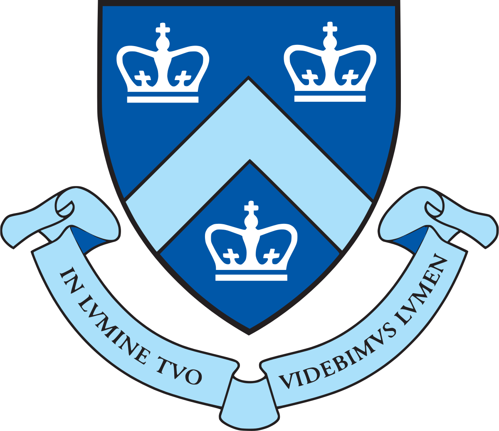

<!--
**cbenge509/cbenge509** is a ✨ _special_ ✨ repository because its `README.md` (this file) appears on your GitHub profile.

Here are some ideas to get you started:

- 🔭 I’m currently working on ...
- 🌱 I’m currently learning ...
- 👯 I’m looking to collaborate on ...
- 🤔 I’m looking for help with ...
- 💬 Ask me about ...
- 📫 How to reach me: ...
- 😄 Pronouns: ...
- ⚡ Fun fact: ...
-->

### Hello World 👋

My name is Cris, and I am a Senior Director of Data Science on the <a href="https://azure.microsoft.com/" target="_blank" style="color: #2C6BAC; font-weight: bold">Azure</a> CHIE team - a division within the Cloud + AI organization - at Microsoft.

I am a graduate of the <a href="https://datascience.berkeley.edu/" target="_blank" style="color: #2C6BAC; font-weight: bold">University of California, Berkeley</a>, where I earned a Master of Information and Data Science. I am also a student at the School of Engineering and Applied Sciences at <a href="https://www.engineering.columbia.edu/departments/computer-science" target="_blank" style="color: #2C6BAC; font-weight: bold">Columbia University in the City of New York</a>, where I'm studying toward a Master of Science in Computer Science with a specialization in Machine Learning (exp 2024).

I have over 20 years of business intelligence, analytics, and data platforms architecture experience providing hands-on consultation and leadership in the Healthcare, Defense, and Federal Civilian sectors. I am passionate about data science, machine learning, statistics, cloud architecture, and building high-performance teams - with a proven track record of leading and delivering successful engagements for some of the largest and most complex data problem areas.

  

   

## Connect with me

.pdf)
 
 
## Expertise

 
 
